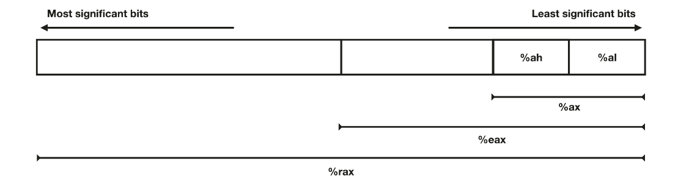

## Register Layout

- %al low byte
- %ah high byte
- %ax least significant 16 bits
- %eax least significant 32 bits
- %rax all 64 bits

## General Purpose Registers

x86-64 has 16 general purpose registers ie. they can be specified as the source or destination of many different instructions. Although they are general purpose, they do have specific use cases. The first 8 registers are from the 32 bit system. The remaining 8 are 64 bit specific.

### Computational Registers

- %rax: Accumulator. Mostly used register for computation 
- %rbs: Base register. Mostly used for indexed addressing
- %rcx: Counter register. Used for repetitive counts (loops)
- %rdx: Data register. Has special significance in certain arithmetic operations and input/output operations and is also sometimes used in some instructions in coordination with %rax, eg with divq instruction.

### Pointer Registers

- %rsi: Source Index register. Used in working with longer spans of memory
- %rdi: Destination Index. Used in conjuction with rsi in longer spans of memory
- %rbp: Base Pointer
- %rsp: Stack Pointer

*Note that these do not have individual byte registers*

### The 'Latest' Registers

These are named from %r8 through %r15. They also have 32-bit, 16-bit and individual byte versions. Eg: 32-bit version of %r11 is %r11d, 16-bit version is %r11w and the least significant byte is %r11b.

## Nomenclature

The q in movq represents quadword (ie 64bits). For double words aka long words (32bits) use l, eg: movl. For words ie 16 bits use w eg: movw and for individual bytes use b eg: movb
